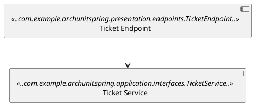
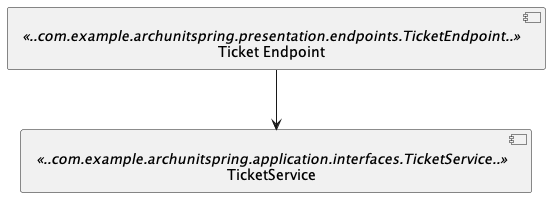

Workshop: implement ArchUnit in your Java Spring Boot project


By: Ricky van Rijn

---

<div style="display: flex; justify-content: center; align-items: center;">
<h3>Ricky van Rijn, Practice Lead JTech</h3>
</div>

<div style="display: flex; justify-content: center; align-items: center;">
    
</div>

<div>
    <div style="display: flex; justify-content: center; align-items: center;">
         
        : @Hanmudo
    </div>
    <div style="display: flex; justify-content: center; align-items: center;">
        
        : @RickyvanRijn
    </div>
</div>

Work experience: Java for 10+ years <br />
Hobby's: Taekwondo, Hapkido, Fitness, Robotics

---

## Why this workshop?

- Customer project
- Lot of deprecated documentation
- Lot of different architecture designs
- Code != Architecture

> Note that the example project is completely fictional

---

## What about you?
> - Who has already looked into ArchUnit?
> - Who has a worked with PlantUML?
> - Who thinks architectural tests are useful?

Note:
- Who has already looked into ArchUnit?
- Who's familiar with the book "Gang of four" based on Design Patterns?
- Who thinks architectural tests are useful?

---

## Why use ArchUnit?

> Why test the architecture?

> Who's behind? Architecture or Development?

> Clean architecture/ Clean code

---

### What is ArchUnit about?

[](image.png)

> Plain Java

> JUnit4/5 compatible

---

## What does ArchUnit

> ArchUnit library is created to test, assert and specify architectural rules.

> This can be a simple dependency, a design pattern or custom rules.

---

## How does ArchUnit work behind the scenes?

> Analyzing bytecode

> Importing all files into a java code structure

---

## How does ArchUnit work in front of the scenes?

> - ArchRule
> - ClassFileImporter
> - FreezingArchRule
> - PlantUML diagram
> - Caching
>
---

### ArchRule

> The ArchRule object represents a rule to specify a set of objects of interest
> 
> The ArchRule object is linked to ArchRuleDefinitions which you can use by the factory methods

---
### Example ArchRule

```java
@Test
public void services_should_be_prefixed() {
    classes()
            .that().resideInAPackage("..service..")
            .and().areAnnotatedWith(CustomService.class)
            .should().haveSimpleNameStartingWith("Service")
            .check(classes);
}
```
---

### ArchRule part 2

> The ArchRule can be used to create a custom ArchRule
>
> The ArchRule can be given a custom object by specifying a transformer to handle the classes


---

### ClassFileImporter

> The ClassFileImporter object is mainly used by the plain java tests
> 
> Imports all classes for example from a package

---
### ClassFileImporter example

```java
private final JavaClasses classes = new ClassFileImporter().importPackages("com.tngtech.archunit.example.layers");

@Test
public void services_should_be_prefixed() {
    classes()
            .that().resideInAPackage("..service..")
            .and().areAnnotatedWith(MyService.class)
            .should().haveSimpleNameStartingWith("Service")
            .check(classes);
}
```
---

### FreezingArchRule

> Similar to @Disable for unit tests but different
> 
> Returns a EvaluationResult when test fails
> 
> Stores violations in a Violation Store
> 
> Violation Store is text based
> 
> By default the rule is indicated with an UUID

---
### FreezingArchRule example

```java
private final JavaClasses classes = new ClassFileImporter().importPackagesOf(ClassViolatingCodingRules.class);

@Test
public void no_classes_should_depend_on_service() {
    freeze(noClasses().should().dependOnClassesThat().resideInAPackage("..service.."))
            .check(classes);
}
```
---

### FreezingArchRule part 2

> The Violation Store name can be set through a property
> 
> The default filename is stored.rules
> 
> The default path can be set in the archunit.properties file in the test/resources folder
> 
> Violation Store can be persisted

---

### FreezingArchRule Violation Store

```text
#
#Sun Jun 09 00:30:33 ICT 2019
no\ classes\ should\ depend\ on\ classes\ that\ reside\ in\ a\ package\ '..service..'=a81a2b54-5a18-4145-b544-7a580aba0425
no\ classes\ should\ depend\ on\ classes\ that\ are\ assignable\ to\ javax.persistence.EntityManager=e77ec262-4d5c-4a7b-b41f-362a71e5a1d8
```
---
### FreezingArchRule Violation

```text
Class <com.tngtech.archunit.example.layers.service.ServiceViolatingDaoRules$MyEntityManager> implements interface <javax.persistence.EntityManager> in (ServiceViolatingDaoRules.java:0)
Field <com.tngtech.archunit.example.layers.persistence.first.dao.jpa.SomeJpa.entityManager> has type <javax.persistence.EntityManager> in (SomeJpa.java:0)
Field <com.tngtech.archunit.example.layers.persistence.second.dao.jpa.OtherJpa.entityManager> has type <javax.persistence.EntityManager> in (OtherJpa.java:0)
Field <com.tngtech.archunit.example.layers.service.ServiceViolatingDaoRules.myEntityManager> has type <com.tngtech.archunit.example.layers.service.ServiceViolatingDaoRules$MyEntityManager> in (ServiceViolatingDaoRules.java:0)
Method <com.tngtech.archunit.example.layers.persistence.first.dao.jpa.SomeJpa.findById(long)> calls method <javax.persistence.EntityManager.find(java.lang.Class, java.lang.Object)> in (SomeJpa.java:20)
Method <com.tngtech.archunit.example.layers.persistence.second.dao.OtherDao.getEntityManager()> has return type <javax.persistence.EntityManager> in (OtherDao.java:0)
Method <com.tngtech.archunit.example.layers.persistence.second.dao.jpa.OtherJpa.findById(long)> calls method <javax.persistence.EntityManager.find(java.lang.Class, java.lang.Object)> in (OtherJpa.java:19)
Method <com.tngtech.archunit.example.layers.persistence.second.dao.jpa.OtherJpa.getEntityManager()> has return type <javax.persistence.EntityManager> in (OtherJpa.java:0)
Method <com.tngtech.archunit.example.layers.persistence.second.dao.jpa.OtherJpa.testConnection()> calls method <javax.persistence.EntityManager.unwrap(java.lang.Class)> in (OtherJpa.java:24)
```
---

### Caching

> ClassFileImporter analyzes all imported classes
> 
> Larger projects take some time as the ClassFileImporter is often used on base package level
> 
> Use @AnalyzeClasses annotation with @ArchTest annotation for reuse of imported classes

---
### AnalyzeClasses example

```java
@AnalyzeClasses(packages = "com.example.archunitspring")
public class ArchSlicesTest { ... }
```
---

### Slices

> Slices are subsets of classes that can be tested against another slice
>
> SliceRule and SliceRuleDefinition objects are used

---
### Slices example

```java
@ArchTest
    static final ArchRule controllers_should_only_use_their_own_slice =
            slices().matching("..controller.(*)..").namingSlices("Controller $1")
                    .as("Controllers").should().notDependOnEachOther();
```

---

### PlantUML component diagram

> The ArchUnit library can use a puml file as source for ArchUnit tests
>
> Architecture patterns are easily tested this way
>
> Don't forget to ignore the java JDK dependencies

---
### Install PlantUML

> - https://plantuml.com/download
>   - Intellij Plugin: https://plugins.jetbrains.com/plugin/7017-plantuml-integration
>   - Eclipse Plugin: https://plantuml.com/eclipse
>   - Live Editor > https://github.com/plantuml/plantuml-server
> 
> Dependency of PlantUML: https://graphviz.org/download/
---
### Basics of PlantUML component diagrams

- Start with a @startuml notation and ends with @enduml notation
- Define the components and link them

 ```text
 [Some Source] <<..com.example.archunitspring.presentation.endpoints.TicketEndpoint..>> 
[Some Target] <<..com.example.archunitspring.application.interfaces.TicketService..>> as target

[Some Source] --> target
 ```

---
### Basics of PlantUML component diagrams

This shows something like:

---
### PlantUML Component Diagram visual

[](image.png)

---
### Basics of PlantUML component diagram

> - Through the adhereToPlantUmlDiagram(..) method there would be a violation reported when target is accessing the source 
> - Import puml file
> - puml file is in similar resource folder
>   - e.g. Your test is situated at: 
>     - src/test/java/com/example/archunitspring/archtest
>   - So you puml file need to be at: 
>     - src/test/resources/com/example/archunitspring/archtest
---

## Best practices + Community

- Create an artifact of the architectural tests for easy maintenance
- Get connected in the wide community of ArchUnit/PlantUML

---
## Part 1: Basic project setup

> First start with checking our example project

Dockerfile phases:
- Maven build + test
- Start application

> Task: Add ArchUnit to the project 

[Go to project setup](/slides/projectsetup/index.md)

Note:
Use the Docker environment for the Dockerfile(s) in the projects

---

## Part 2: Basic rules

The basic rules apply on simple cases with low complexity

[Go to basic rules](/slides/basicrules/index.md)

Note: 
Check for the right usage of packages
---

## Part 3: Intermediate rules

Check on patterns and antipatterns

[Go to intermediate rules](/slides/intermediaterules/index.md)

Note:
The intermediate rules are for checking on patterns and anti-patterns

---

## Part 4: Integrate in build process

* Freeze
* Violations

[Go to CI/CD](/slides/cicd/index.md)

Note: Old concurrency the thread was a wrapper around an OS thread. The loom variant has taken control towards inside the JVM.

---

## Part 5: Advanced rules

- Use of PlantUML file

[Go to advanced rules](/slides/advancedrules/index.md)

---

# The End.
## Questions?
