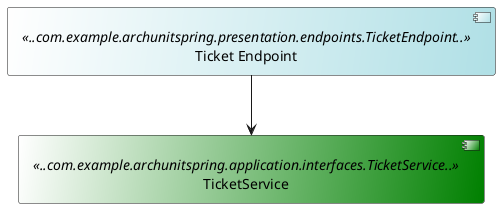
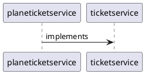

Mini-lab: Test Driven Architecture accompanied with Architecture as Code


By: Ricky van Rijn

---

<div style="display: flex; justify-content: center; align-items: center;">
<h3>Ricky van Rijn</h3>
</div>

<div style="display: flex; justify-content: center; align-items: center;">
<p>Practice Lead JTech</p>
</div>

<div style="display: flex; justify-content: center; align-items: center;">
    
</div>

<div>
    <div style="display: flex; justify-content: center; align-items: center;">
         
        : @Hanmudo
    </div>
    <div style="display: flex; justify-content: center; align-items: center;">
        
        : @RickyvanRijn
    </div>
</div>

Work experience: Java for 10+ years <br />
Hobby's: Taekwondo, Hapkido, Fitness, Robotics

---

## Why this workshop?

- Projects fail due to bad architecture follow-up
- Lot of deprecated documentation
- Lot of different architecture (concept) designs
- Code != Architecture

> Note that the example project is completely fictional

---

## What's in this workshop?
> 1. Project setup
> 2. Basic implementation
> 3. Advanced implementation
> 4. Performance optimization
> 5. PlantUML implementation

---

## Why use ArchUnit?

> Test the architecture of your project

> Architecture is stored in the code

> Clean architecture / Clean code

---

### What is ArchUnit about?

[](image.png)

> Plain Java tests

> JUnit4/5 compatible tests

---
### What is PlantUML about

>- PlantUML is to create UML diagrams from code
>- Component Diagram is used for ArchUnit tests
>- Store the architecture near the code implementation
---
### Together they are a powerful combination

[](image.png)

---

## What does ArchUnit do?

> ArchUnit library is created to test, assert and specify architectural rules.

> This can be a simple dependency, a design pattern or anti-pattern.

> Unit testing but for architecture 

---

## How does ArchUnit work behind the scenes?

> Analyzing bytecode

> Importing all files into a java code structure

> Apply rules on the java code structure

---

## How does ArchUnit work in front of the scenes?

> - ArchRule
> - ClassFileImporter
> - FreezingArchRule
> - PlantUML diagram
> - Caching
>

---

## Part 1: Project Start

- Workshop Presentation: <a href="https://hanmudo.github.io/archunit-workshop/" target="_blank">https://hanmudo.github.io/archunit-workshop/</a>

- Open the presentation in your browser

---

## Project Setup 

- Clone GitLab repository
    - Example Project: <a href="https://github.com/Hanmudo/archunit-spring" target="_blank">https://github.com/Hanmudo/archunit-spring</a>
    - Use the basicrules branch

- Check if IDE is correctly configured
- Run application

---

## Run project

> Three options to run the project:
> 
> I recommend to use the IDE
> 1. **Run the application with the IDE**
> 2. Run the mvn package docker:build docker:start command with a local maven installation
> 3. Run the Dockerfile with a build stage before starting the jar > ./buildAndStart.sh


---
### Install PlantUML extensions/plugins

> - https://plantuml.com/download
    >   - Intellij Plugin: https://plugins.jetbrains.com/plugin/7017-plantuml-integration
    >   - Eclipse Plugin: https://plantuml.com/eclipse
>   - Live Editor > https://github.com/plantuml/plantuml-server
---

### (Optional) Install PlantUML

>- Download PlantUML and start it or use docker
   >   - https://github.com/plantuml/plantuml-server
>   - `docker run -d -p 8080:8080 plantuml/plantuml-server:jetty`


---

### Install PLantUML dependencies

> Dependency of PlantUML: https://graphviz.org/download/
>
> When an error occurs of the **dot** application, you'll need to (re-)install graphviz

---
### Working PlantUML extension
[](image.png)
---

## Example Project
The sample project we're using for the workshop is based on a Spring Boot API.

The purpose of the API is to receive a call to get ticket data concerning a plane or train.

---

### Add ArchUnit dependency

Maven
```xml
<dependency>
    <groupId>com.tngtech.archunit</groupId>
    <artifactId>archunit</artifactId>
    <version>1.3.0</version>
    <scope>test</scope>
</dependency>
```

Gradle
```groovy
dependencies {
    testImplementation 'com.tngtech.archunit:archunit:1.3.0'
}
```

---

### ClassFileImporter

> The ClassFileImporter object is mainly used by the plain java tests
>
> Imports all classes from a given package recursively

---
### ClassFileImporter example

```java
private final JavaClasses classes = new ClassFileImporter().importPackages("com.tngtech.archunit.example.layers");

@Test
public void services_should_be_prefixed() {
    classes()
            .that().resideInAPackage("..service..")
            .and().areAnnotatedWith(MyService.class)
            .should().haveSimpleNameStartingWith("Service")
            .check(classes);
}
```
---
### Practice: Create a basic ArchRule

> The ArchRule object represents a rule to specify a set of objects of interest
>
> The ArchRule object is linked to ArchRuleDefinitions which you can use by the factory methods
---
### Example ArchRule

```java
@Test
public void services_should_be_prefixed() {
    classes()
            .that().resideInAPackage("..service..")
            .and().areAnnotatedWith(Service.class)
            .should().haveSimpleNameStartingWith("Service")
            .check(classes);
}
```
---
### Create a test class

> - Create a folder named 'arch' in the src/test/java folder
> - Create a test class named 'PackageDependencyRulesTest' in the src/test/java/arch folder
> 
---
### Test class example
[](image.png)

---
### Test class example

```java
package com.example.archunitspring.arch;

import com.tngtech.archunit.core.domain.JavaClasses;
import com.tngtech.archunit.core.importer.ClassFileImporter;
import org.junit.jupiter.api.Test;
import org.springframework.stereotype.Service;

import static com.tngtech.archunit.lang.syntax.ArchRuleDefinition.classes;

public class PackageDependencyRulesTest {

    @Test
    public void services_should_be_postfixed() {
        JavaClasses importedClasses = new ClassFileImporter().importPackages("com.example.archunitspring");
        classes()
                .that().resideInAPackage("..services..")
                .and().areAnnotatedWith(Service.class)
                .should().haveSimpleNameEndingWith("ServiceImpl")
                .check(importedClasses);
    }
}

```
---
### JUnit integration

> - JUnit4/5 can be used for the ArchUnit tests
> - It contains annotations and runners for the ArchUnit tests
> 
---
### Junit4 dependency (next for JUnit5)

Maven
```xml
<dependency>
    <groupId>com.tngtech.archunit</groupId>
    <artifactId>archunit-junit4</artifactId>
    <version>1.3.0</version>
    <scope>test</scope>
</dependency>
```

Gradle
```groovy
dependencies {
    testImplementation 'com.tngtech.archunit:archunit-junit4:1.3.0'
}
```
---

### Junit4 ArchUnit example (next for JUnit5)

```java
@RunWith(ArchUnitRunner.class)
@AnalyzeClasses(packages = "com.example.archunitspring.application.services")
public class ArchUnitJunit4Test {

    @ArchTest
    public static ArchRule services_should_be_prefixed =
            classes()
                    .that().resideInAPackage("..services..")
                    .and().areAnnotatedWith(Service.class)
                    .should().haveSimpleNameStartingWith("Service");
}
```

---
### Junit5 dependency

Maven
```xml
<dependency>
    <groupId>com.tngtech.archunit</groupId>
    <artifactId>archunit-junit5</artifactId>
    <version>1.3.0</version>
    <scope>test</scope>
</dependency>
```

Gradle
```groovy
dependencies {
    testImplementation 'com.tngtech.archunit:archunit-junit5:1.3.0'
}
```
---

### Junit5 ArchUnit example

```java
import static com.tngtech.archunit.lang.syntax.ArchRuleDefinition.classes;

@AnalyzeClasses(packages = "com.example.archunitspring.application.services")
public class ArchUnitJunit5Test {

    @ArchTest
    static ArchRule services_should_be_prefixed =
            classes()
                    .that().resideInAPackage("..services..")
                    .and().areAnnotatedWith(Service.class)
                    .should().haveSimpleNameStartingWith("Service");
}
```
---

### Refactor the PackageDependencyRulesTest

> - Refactor the test class to use the JUnit4 or 5 annotations
---

### regex syntax or not?

> ```java
>    resideInAPackage("..services..")
> ```

> - The AspectJ like syntax is used for the package names
> - .. The two dots represent many packages
> - (*) is used for one package

---
### Create an inheritance rule

>- Create a rule that checks if the TickerServiceImpl class in the services package
>- Check if the class is implementing the right interface
> 
>- Create the test class 'InheritanceRulesTest' in the arch folder 
>- Create the test method 'ticketservice_classes_should_implement_interfaces' in the test class

---

### Code example

```java
@Test
public void ticketservice_classes_should_implement_interfaces() {
    JavaClasses importedClasses = new ClassFileImporter().importPackages("com.example.archunitspring");
    classes()
            .that().implement(TicketService.class)
            .should().haveSimpleNameEndingWith("ServiceImpl")
            .check(importedClasses);
}
```
---

### Folder screenshot

[](image.png)

---

### Create a Layered Architecture rule

>- Create the test class 'LayeredArchitectureTest' in the arch test folder
>- Check if classes reside in any of your defined packages (layers)

```java
@Test
public void basic_layered_architecture_is_enforced() {
    classes().should().resideInAnyPackage("..application..", "..infrastructure..", "..presentation..")
            .because("Classes should be organised in a layered architecture").check(importedClasses);
}
```
---
### The test should fail!

>- The test should fail as default Spring Boot Application class is in the root folder
>- But there's more!
---
### What do you see?
[](image.png)

---
### All classes are imported
> Including test classes
---

### Start using the @AnalyzeClasses annotation

>- The @AnalyzeClasses annotation is used to import classes from a package
>- Multiple parameters can be used
>- Package to import
>- ImportOptions
>- classes are reused for tests with the @AnalyzesClasses annotation
>- Performance optimization!

---
### Adjust the test class 'LayeredArchitectureTest' in the arch folder
>- Check if you're using the archunit-junit or archunit-junit5 dependency
>- Note that the notation is different
```java
@AnalyzeClasses(packages = "com.example.archunitspring", importOptions = {ImportOption.DoNotIncludeTests.class})
public class LayeredArchitectureRulesTest {
    @ArchTest
    static final ArchRule testLayeredArchitecture =
        classes().should().resideInAnyPackage("..application..", "..infrastructure..", "..presentation..")
                .because("Classes should be organised in a layered architecture");

}
```
---
### What do you see?
[](image.png)

---
### The test still fails!
> The test still fails but the test classes are excluded from the import
---
### Focus on pre-defined functionality
>- Instead use the layered architecture functionality
>- Refactor the ArchTest again and make it run

```java
@ArchTest
static final ArchRule testLayeredArchitecture =
        layeredArchitecture().consideringAllDependencies()
                // Define layers
                .layer("Presentation").definedBy("..presentation..")
                .layer("Infrastructure").definedBy("..infrastructure..")
                .layer("Application").definedBy("..application..")
                // Add constraints
                .whereLayer("Presentation").mayNotBeAccessedByAnyLayer()
                .whereLayer("Application").mayOnlyBeAccessedByLayers("Infrastructure")
                .whereLayer("Infrastructure").mayOnlyBeAccessedByLayers("Presentation", "Application");
```
---
### Anti-patterns
>- Anti-patterns are to help you to avoid common pitfalls
>- Let's try one for the microservice architecture
>- Create a test class 'AntiPatternRulesTest' in the arch folder
>- Create an ArchTest 'domainClassesShouldNotDependOnEachOther' in the test class
>
---
### Anti-pattern example
> Code example
> ```java
@Test
public void domainClassesShouldNotDependOnEachOther() {
    SlicesRuleDefinition.slices()
            .matching("example.(*service).domain")
            .should().notDependOnEachOther()
            .check(classes);
}
> ```
---
### Slices
> Based on previous slide
>- Slices are subsets of classes that can be tested against another slice
>- matching method is using AspectJ oriented syntax

---
### Slices
>- example is the top package
>- (*service) is the package layer name with a wildcard in it 
>  - e.g. springservice and jakartaservice will match
>- domain is the subpackage where the slice will fill it's classes with
---
### Create AntiPattern test
>- Create a test class 'AntiPatternRulesTest' in the arch folder
>- Create an ArchTest 'domainClassesShouldNotDependOnEachOther' in the test class
>- Use the SlicesRuleDefinition to create the rule
>- Use the ArchTest and AnalyzeClases annotations
---
### PlantUML Component Diagram
> - The ArchUnit library can use a puml file as source for ArchUnit tests
> - Architecture patterns are easily tested this way
> - Use the PlantUML component diagram
---
### PlantUML Component Diagram notation
> - Start with a @startuml notation and ends with @enduml notation
> - Define the components and link them

---
### Create the puml
>- Create a puml file in the test/resources folder
>- The folder needs to be the same as the test class
>- The filename of the uml can be customized
---
### Example
[](image.png)
---
### PlantUML Component Diagram visual
[](image.png)
---
### PlantUML tips
>- the --> and -> are arrow notations
>- double dashes are vertically oriented
>- single dashes are horizontally oriented
>- Add [component] as footer forces a component diagram
---
### Create the PlantUML test
>- Create a test class 'PlantUmlRulesTest' in the arch folder
>- Create an ArchTest 'classes_should_adhere_to_diagram' in the test class
>- Use the adhereToPlantUmlDiagram method
>- Use the PlantUML diagram you created
>- Use the ArchTest and AnalyzeClases annotations
---
### PlantUML include file
```java
private static final URL plantUmlDiagram = PlantUMLRulesTest.class.getResource("basic.puml");
```
---
### PlantUML code
```java
@ArchTest
static final ArchRule classes_should_adhere_to_plantuml_considering_only_dependencies_in_diagram =
        classes().should(adhereToPlantUmlDiagram(plantUmlDiagram, consideringOnlyDependenciesInDiagram()));
```
---
### Create PlantUML with implements


---
### Visual PlantUML diagram
[](image.png)

---
### Ready to build functionality!
>- Build the functionality which is based on the architecture
>- The ArchUnit tests are used to validate the architecture
>- The PlantUML file can be used to represent the architecture
>- The PlantUML file can be maintained by Solution Architects 
---
### The End
> or is it? 
---
### There's a bit more if there's time...
>- FreezingArchRule(s)
>- Violation Store

---
### FreezingArchRule

> Similar to @Disabled for unit tests
> 
> Returns a EvaluationResult when test fails
> 
> Stores violations in a Violation Store
> 
> Violation Store is text based
> 
> By default the rule is indicated with an UUID

---
### FreezingArchRule example

```java
private final JavaClasses classes = new ClassFileImporter().importPackagesOf(ClassViolatingCodingRules.class);

@Test
public void no_classes_should_depend_on_service() {
    freeze(noClasses().should().dependOnClassesThat().resideInAPackage("..service.."))
            .check(classes);
}
```
---
### Create Freezing ArchRule
>- Adjust a test and 'freeze' it
---
### Configure the Violation Store

> The Violation Store name can be set through a property
> 
> The default filename configured is stored.rules
> 
> The default path can be set in the archunit.properties file in the test/resources folder
> 
> Violation Store can be persisted

---

### Violation Store Example

```text
#
#Sun Jun 09 00:30:33 ICT 2019
no\ classes\ should\ depend\ on\ classes\ that\ reside\ in\ a\ package\ '..service..'=a81a2b54-5a18-4145-b544-7a580aba0425
no\ classes\ should\ depend\ on\ classes\ that\ are\ assignable\ to\ javax.persistence.EntityManager=e77ec262-4d5c-4a7b-b41f-362a71e5a1d8
```
---
### FreezingArchRule Violation Example

```text
Class <com.tngtech.archunit.example.layers.service.ServiceViolatingDaoRules$MyEntityManager> implements interface <javax.persistence.EntityManager> in (ServiceViolatingDaoRules.java:0)
Field <com.tngtech.archunit.example.layers.persistence.first.dao.jpa.SomeJpa.entityManager> has type <javax.persistence.EntityManager> in (SomeJpa.java:0)
Field <com.tngtech.archunit.example.layers.persistence.second.dao.jpa.OtherJpa.entityManager> has type <javax.persistence.EntityManager> in (OtherJpa.java:0)
Field <com.tngtech.archunit.example.layers.service.ServiceViolatingDaoRules.myEntityManager> has type <com.tngtech.archunit.example.layers.service.ServiceViolatingDaoRules$MyEntityManager> in (ServiceViolatingDaoRules.java:0)
Method <com.tngtech.archunit.example.layers.persistence.first.dao.jpa.SomeJpa.findById(long)> calls method <javax.persistence.EntityManager.find(java.lang.Class, java.lang.Object)> in (SomeJpa.java:20)
Method <com.tngtech.archunit.example.layers.persistence.second.dao.OtherDao.getEntityManager()> has return type <javax.persistence.EntityManager> in (OtherDao.java:0)
Method <com.tngtech.archunit.example.layers.persistence.second.dao.jpa.OtherJpa.findById(long)> calls method <javax.persistence.EntityManager.find(java.lang.Class, java.lang.Object)> in (OtherJpa.java:19)
Method <com.tngtech.archunit.example.layers.persistence.second.dao.jpa.OtherJpa.getEntityManager()> has return type <javax.persistence.EntityManager> in (OtherJpa.java:0)
Method <com.tngtech.archunit.example.layers.persistence.second.dao.jpa.OtherJpa.testConnection()> calls method <javax.persistence.EntityManager.unwrap(java.lang.Class)> in (OtherJpa.java:24)
```
---

### 'Caching'

> ClassFileImporter analyzes all imported classes
> 
> Larger projects take some time as the ClassFileImporter is often used on base package level
> 
> Use @AnalyzeClasses annotation with @ArchTest annotation for reuse of imported classes

---

### Slices

> Slices are subsets of classes that can be tested against another slice
>
> SliceRule and SliceRuleDefinition objects are used

---
### Slices example

```java
@ArchTest
    static final ArchRule controllers_should_only_use_their_own_slice =
            slices().matching("..controller.(*)..").namingSlices("Controller $1")
                    .as("Controllers").should().notDependOnEachOther();
```

---

## Best practices + Community

- Create an artifact of the architectural tests for easy maintenance
- Get connected in the wide community of ArchUnit/PlantUML

---
## Extra: Basic rules

The basic rules apply on simple cases with low complexity

[Go to basic rules](/slides/basicrules/index.md)

Note: 
Check for the right usage of packages
---

## Extra: Intermediate rules

Check on patterns and antipatterns

[Go to intermediate rules](/slides/intermediaterules/index.md)

Note:
The intermediate rules are for checking on patterns and anti-patterns

---

## Extra: Integrate in build process

* Freeze
* Violations

[Go to CI/CD](/slides/cicd/index.md)

---

# The Real End.
## Questions? Send me an email or connect on LinkedIn
